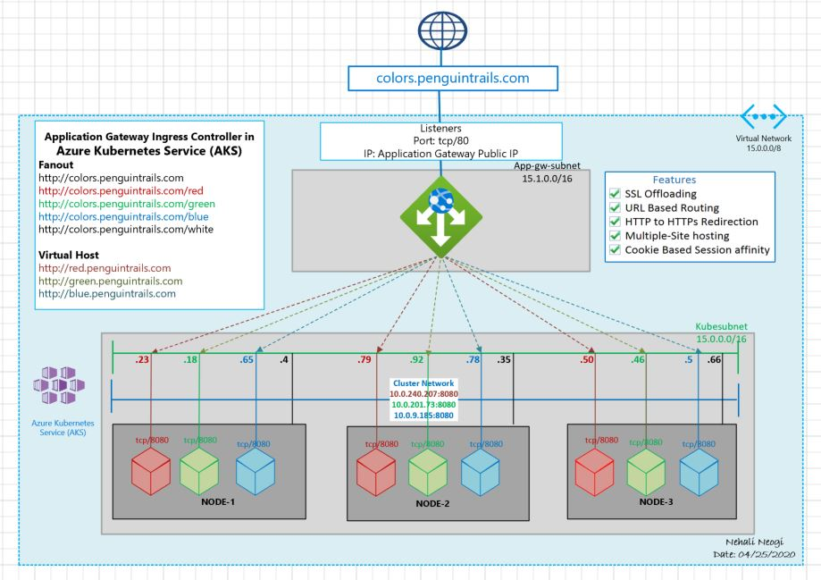

# Application Gateway as Ingress Controller with Azure Kubernetes Service
#
# Blog link
#
https://nehalineogi.blogspot.com/
#
# Architecture Diagram

#
# Test Drive
Fanout
* http://colors.penguintrails.com
* http://colors.penguintrails.com/red
* http://colors.penguintrails.com/green
* http://colors.penguintrails.com/blue
* http://colors.penguintrails.com/white

Virtual Host
* http://red.penguintrails.com
* http://green.penguintrails.com
* http://blue.penguintrails.com
* default-white

# Howto

# Create Namespace
```
kubectl create namespace colors-ns
```
# Create Deployments
```
 kubectl apply -f red-deployment.yaml
 kubectl apply -f green-deployment.yaml
 kubectl apply -f blue-deployment.yaml
 kubectl apply -f white-deployment.yaml
```
#
# Ingress
#
```
kubectl apply -f colors-fanout.yaml
kubectl apply -f colors-virtual-host.yaml
```
